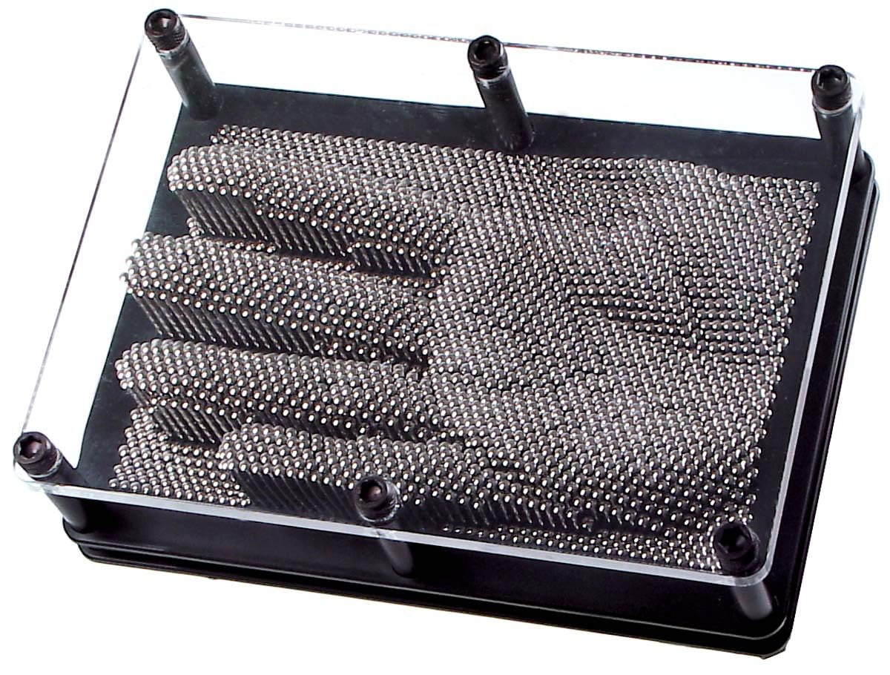

# [Real-time Metal Pin Art with Depth Estimation](https://vncntt.github.io/metal_pins)

Remember those metal pin art toys you'd press your face or hands into as a kid? 
You can now use your webcam to create a virtual pin art display in real-time! Wave, make faces, or get creative - the pins will follow your every move. 🎨 ✨

This application creates a virtual pin art display using your webcam and real-time depth estimation. The app uses the Depth-Anything-V2-small model with HuggingFace's transformers.js to generate depth maps from webcam input and simulates a 3D pin art board using Three.js.

<p align="center">
  
</p>

 <!-- You'll need to add this -->

## Running Locally 

1. Clone this repository
   ```bash
   git clone https://github.com/vncntt/metal_pins.git
   cd metal_pins
   ```
2. Install dependencies:
   ```bash
   npm install
   ```
3. Start a local server:
   ```bash
   npm run dev
   ```
4. Enjoy :)

## Requirements

- Modern web browser with WebGPU support
  > **Note**: WebGPU may need to be enabled manually in Chrome by visiting `chrome://flags/` and enabling both "Unsafe WebGPU Support" and "WebGPU Developer Features"
- Webcam access
- GPU recommended for better performance
- Node.js 16+ and npm installed

## How It Works

1. Captures webcam feed in real-time
2. Processes each frame through Depth-Anything-V2-small model
3. Generates a depth map of the scene
4. Maps depth values to pin heights in the 3D simulation
5. Renders the result with realistic materials and lighting

## Troubleshooting

- If the webcam doesn't start, make sure you've granted camera permissions
- For performance issues, try reducing the pin density in the settings
- Check that WebGPU is properly enabled in your browser

## Credits

- My GOATs Cursor + Claude 3.5 Sonnet
- [Depth Anything V2](https://github.com/LiheYoung/Depth-Anything) for the depth estimation model
- [Three.js](https://threejs.org/) for 3D rendering
- [Hugging Face](https://huggingface.co/) for model hosting and Transformers.js

## Contributing

This is just a weekend project and has lots of room for improvement. Try to make more fine-grained features appear and submit a PR!